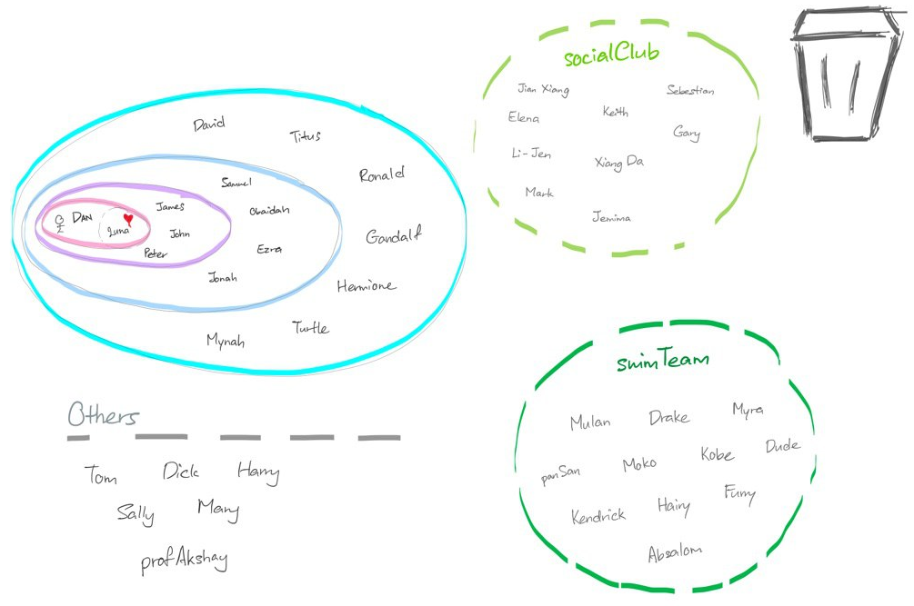

= slaveFinder()
ifdef::env-github,env-browser[:relfileprefix: docs/]

https://travis-ci.org/CS2103-AY1819S2-W15-3/main[image:https://travis-ci.org/CS2103-AY1819S2-W15-3/main.svg?branch=master[Build Status]]
https://ci.appveyor.com/project/WeeSooJun/main[image:https://ci.appveyor.com/api/projects/status/6sdm7tsfki1ubrcf?svg=true[Build status]]
https://coveralls.io/github/CS2103-AY1819S2-W15-3/main?branch=master[image:https://coveralls.io/repos/github/CS2103-AY1819S2-W15-3/main/badge.svg?branch=master[Coverage Status]]
https://www.codacy.com/app/damith/addressbook-level4?utm_source=github.com&utm_medium=referral&utm_content=se-edu/addressbook-level4&utm_campaign=Badge_Grade[image:https://api.codacy.com/project/badge/Grade/fc0b7775cf7f4fdeaf08776f3d8e364a[Codacy Badge]]

ifdef::env-github[]

endif::[]

ifndef::env-github[]
image::images/socialCircle.png[width="600"]
endif::[]

* This is a desktop Address Book application. It has a GUI but most of the user interactions happen using a CLI (Command Line Interface).

== Site Map

* <<UserGuide#, User Guide>>
* <<DeveloperGuide#, Developer Guide>>
* <<AboutUs#, About Us>>
* <<ContactUs#, Contact Us>>

== Acknowledgements

* AddressBook-Level4 project created by SE-EDU initiative at https://github.com/se-edu/

== Licence : link:LICENSE[MIT]
