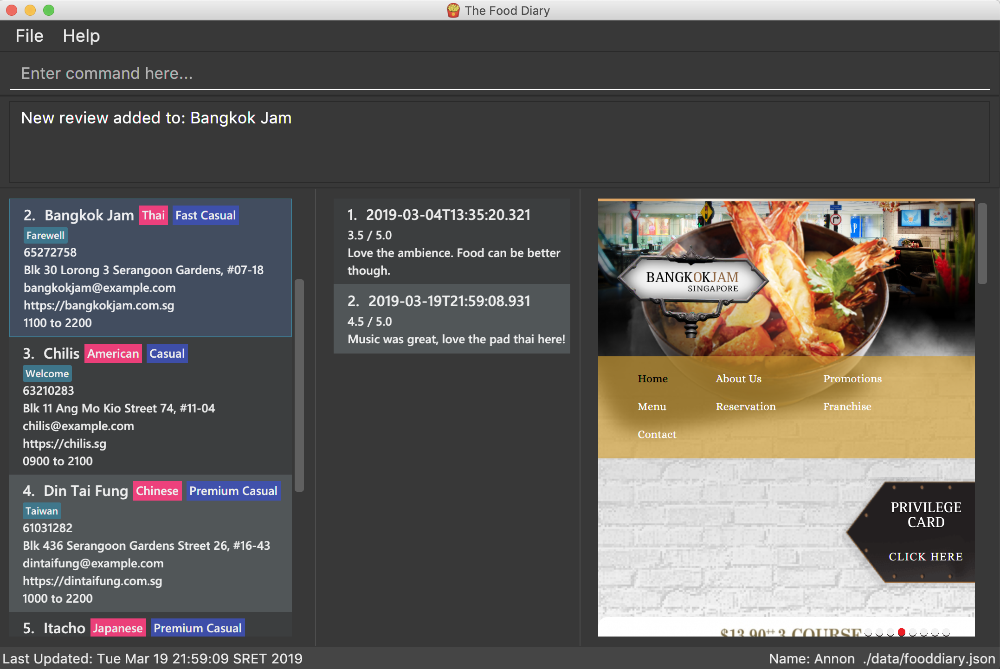

ifdef::env-github,env-browser[:relfileprefix: docs/]

ifdef::env-github[]

endif::[]

ifndef::env-github[]
image::images/thefooddiary.png[float=right, width="175"]
endif::[]

= The Food Diary

https://travis-ci.org/CS2103-AY1819S2-W17-1/main[image:https://travis-ci.org/CS2103-AY1819S2-W17-1/main.svg?branch=master["Build Status", link="https://travis-ci.org/CS2103-AY1819S2-W17-1/main"]]
https://coveralls.io/github/CS2103-AY1819S2-W17-1/main?branch=master[image:https://coveralls.io/repos/github/CS2103-AY1819S2-W17-1/main/badge.svg?branch=master[Coverage Status]]

Calling all tech-savvy foodies out there! The Food Diary is a one stop desktop application for all food lovers to document
their food adventures and receive personalised recommendations for the next restaurant they might want to visit!

ifdef::env-github[]

endif::[]

ifndef::env-github[]
image::images/UiUpdated.png[width="1000"]
endif::[]

== Site Map

* <<UserGuide#, User Guide>>
* <<DeveloperGuide#, Developer Guide>>
* <<AboutUs#, About Us>>
* <<ContactUs#, Contact Us>>

== Acknowledgements

* Some parts of this sample application were inspired by the excellent http://code.makery.ch/library/javafx-8-tutorial/[Java FX tutorial] by
_Marco Jakob_.
* Libraries used: https://github.com/TestFX/TestFX[TextFX], https://github.com/FasterXML/jackson[Jackson], https://github.com/google/guava[Guava], https://github.com/junit-team/junit5[JUnit5]
* This project is inspired from the AddressBook-Level4 project created by SE-EDU initiative at https://github.com/se-edu/[SE-EDU]

== Licence : link:LICENSE[MIT]
