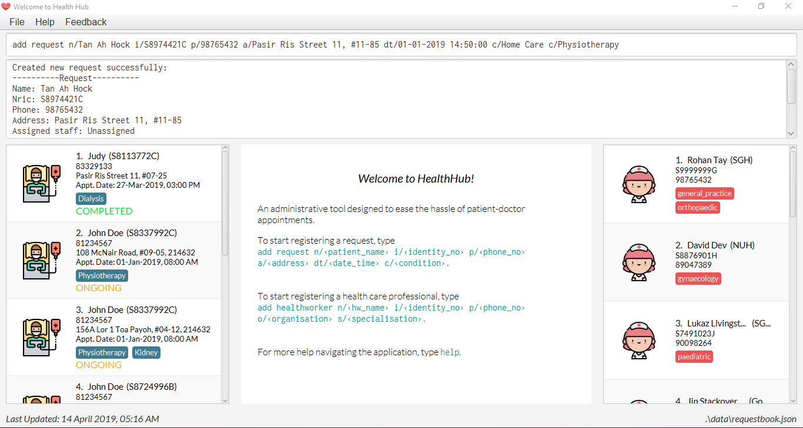

= HealthHub

https://travis-ci.com/CS2103-AY1819S2-W09-2/main[image:https://travis-ci.com/CS2103-AY1819S2-W09-2/main.svg?branch=master[Build Status]]
https://coveralls.io/github/CS2103-AY1819S2-W09-2?branch=master[image:https://coveralls.io/repos/github/main/badge.svg?branch=master[Coverage Status]]
image:https://api.codacy.com/project/badge/Grade/59b2e00f57cf432eab91667b827851b9[link="https://app.codacy.com/app/CS2103-AY1819S2-W09-2/main?utm_source=github.com&utm_medium=referral&utm_content=CS2103-AY1819S2-W09-2/main&utm_campaign=Badge_Grade_Dashboard"]

ifdef::env-github[]

endif::[]

ifndef::env-github[]

endif::[]

== Why HealthHub?

“Based on trends, if we project into 2050, even with immigration, the population pyramid will be inverted ...
We are going to be growing old faster than any society in the world.”
                                                                            -Lee Hsien Loong, Prime Minister of Singapore

With the number of elderly slated to reach 900,000 by 2030, it is no surprise that the resources to meet the healthcare
demands of the nation are being stretched thin. Even today, it is getting harder and harder to have healthcare professionals
come down to our homes to tend to the elderly, on top of their already burgeoning workload in their workplaces.

Luckily, we now have HealthHub

HealthHub is the first centralized healthcare platform on the market which allows for healthcare professionals (in the
form of doctors and nurses) and qualified individuals from the community to tend to the needs of elderly at their own
homes. With a dedicated core administrative team, HealthHub intends to match skilled individuals to their respective
jobs efficiently and effectively.

== Target Group

HealthHub is looking at 2 large groups of target users.

* The 1st group comprises qualified individuals with necessary skills, be it basic healthcare skills like administering
IV drip, to higher-level skills like handling dialysis machinery.
* The 2nd group comprises

** The elderly needing help at home and

** Guardians of the elderly requiring additional healthcare at home

== Site Map

* https://github.com/CS2103-AY1819S2-W09-2/main/blob/master/docs/UserGuide.adoc[User Guide]
* https://github.com/CS2103-AY1819S2-W09-2/main/blob/master/docs/DeveloperGuide.adoc[Developer Guide]
* http://github.com/CS2103-AY1819S2-W09-2/main/blob/master/docs/AboutUs.adoc[About Us]
* https://github.com/CS2103-AY1819S2-W09-2/main/blob/master/docs/ContactUs.adoc[Contact Us]

== Acknowledgements

* Original Source Code created by SE-EDU initiative: https://github.com/se-edu/[Original Source Code]

* Libraries used: https://github.com/TestFX/TestFX[TextFX], https://github.com/FasterXML/jackson[Jackson], https://github.com/google/guava[Guava], https://github.com/junit-team/junit5[JUnit5]

== Licence : link:LICENSE[MIT]
