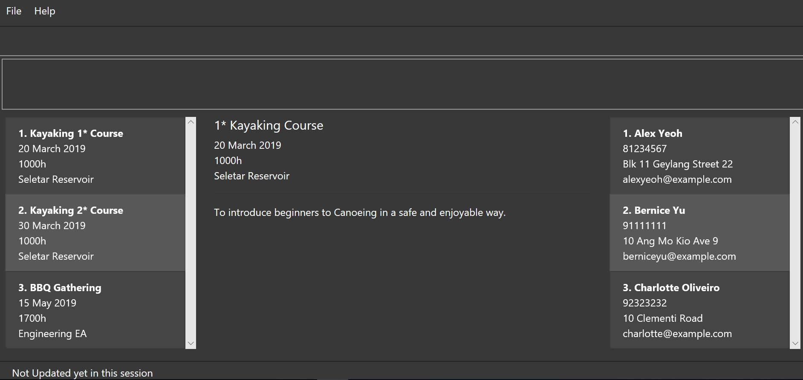

= ClubManager
ifdef::env-github,env-browser[:relfileprefix: docs/]

https://travis-ci.org/cs2103-ay1819s2-w13-2/main[image:https://travis-ci.org/cs2103-ay1819s2-w13-2/main.svg?branch=master[Build Status]]
https://ci.appveyor.com/project/damithc/addressbook-level4[image:https://ci.appveyor.com/api/projects/status/3boko2x2vr5cc3w2?svg=true[Build status]]
https://coveralls.io/github/se-edu/addressbook-level4?branch=master[image:https://coveralls.io/repos/github/se-edu/addressbook-level4/badge.svg?branch=master[Coverage Status]]
https://www.codacy.com/app/damith/addressbook-level4?utm_source=github.com&utm_medium=referral&utm_content=se-edu/addressbook-level4&utm_campaign=Badge_Grade[image:https://api.codacy.com/project/badge/Grade/fc0b7775cf7f4fdeaf08776f3d8e364a[Codacy Badge]]

ifdef::env-github[]

endif::[]

ifndef::env-github[]
image::images/UiUpdate.png[width="600"]
endif::[]

* ClubManager is a desktop application for CCA management. It has a GUI but most of the user interactions happen using a CLI (Command Line Interface).
* It is designed for CCA committee members to better manage their members and activities.
* This app is comes with a laconic UI and the following features:
** Add, delete, edit and manage member information.
** Add, update activities and take attendance.
** Get basic member statistics.
** Import/Export.
** And many more!

== Site Map

* <<UserGuide#, User Guide>>
* <<DeveloperGuide#, Developer Guide>>
* <<AboutUs#, About Us>>
* <<ContactUs#, Contact Us>>

== Acknowledgements
* This application is based on https://github.com/nus-cs2103-AY1819S1/addressbook-level4[AddressBook Level 4].
* Some parts of this sample application were inspired by the excellent http://code.makery.ch/library/javafx-8-tutorial/[Java FX tutorial] by
_Marco Jakob_.
* Libraries used: https://github.com/TestFX/TestFX[TextFX], https://github.com/FasterXML/jackson[Jackson], https://github.com/google/guava[Guava], https://github.com/junit-team/junit5[JUnit5]

== Licence : link:LICENSE[MIT]
