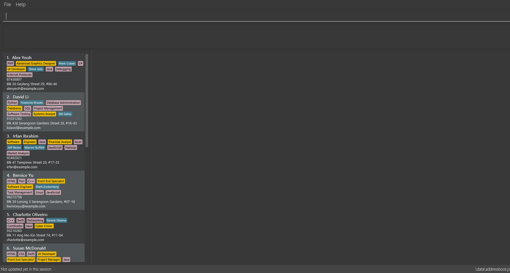

= Recruit Me
ifdef::env-github,env-browser[:relfileprefix: docs/]

https://travis-ci.org/cs2103-ay1819s2-w16-4[image:https://travis-ci.org/cs2103-ay1819s2-w16-4/main.svg?branch=master[Build Status]]
https://ci.appveyor.com/project/damithc/addressbook-level4[image:https://ci.appveyor.com/api/projects/status/3boko2x2vr5cc3w2?svg=true[Build status]]
https://coveralls.io/github/se-edu/addressbook-level4?branch=master[image:https://coveralls.io/repos/github/se-edu/addressbook-level4/badge.svg?branch=master[Coverage Status]]
https://www.codacy.com/app/damith/addressbook-level4?utm_source=github.com&utm_medium=referral&utm_content=se-edu/addressbook-level4&utm_campaign=Badge_Grade[image:https://api.codacy.com/project/badge/Grade/fc0b7775cf7f4fdeaf08776f3d8e364a[Codacy Badge]]
https://gitter.im/se-edu/Lobby[image:https://badges.gitter.im/se-edu/Lobby.svg[Gitter chat]]

ifdef::env-github[]

endif::[]

ifndef::env-github[]
image::images/UI.png[width="600"]
endif::[]

This application is a Java Desktop GUI application that is specifically designed for a recruiting agency for their processes about the candidates in their storage.

- **Some aspects about the application itself**:
* Although it is a GUI application, all the commands are taken through CLI (Command Line Interface). You can learn how to use it by reading User Guide Document linked below.
* This application requires Java 9 for a proper working experience.

- **A summary of what can be done through this application**:
* A new candidate can be added to the storage
* Candidates can be deleted
* Candidates can be edited according to their aspects
* Candidates can be filtered according to their every different aspect
* Candidates can be sorted according to their features
* Candidates can be listed and selected
* The processes made can be undone and redone
* A specific search according to the candidate name can be done
* All the candidate storage can be cleared.

- **In Version 2.0 (expected)**:
* CVs of the candidates can be shown in the right window block when they are clicked

- **In Version 1.4 (expected)**:
* Integration tests will be made for filtering, also some additions and improvements in unit tests will take place

- **In Version 1.3**:
** Unit tests for filtering processes are written.

- **In Version 1.2**:
* Tag search function with keyword tag. Creating color coordination for each category in UI.
* Filtering system will be improved and filtering for multiple entries will be added. Filtering is also made compatible with other commands.
* Implement method into application ensuring it is callable through the keyword sort. The sort feature should also be able to account for new parameters (e.g. Birthday, Education level etc.) as the client requires.

- **In Version 1.1**:
* Refactoring of Tag Class
* Basic implementation of filtering system is added to the application, that filters the contacts according to one of their properties.
* Parameters for each contact to include valuable information for clients in their profile: Education, Grade point average.
* A general method for sorting a data set with the structure used in.

- **In Version 1.0**:
* The base of the application is uploaded to the Github organization page.

== Site Map

* <<UserGuide#, User Guide>>
* <<DeveloperGuide#, Developer Guide>>
* <<LearningOutcomes#, Applied Techniques in the Application>>
* <<AboutUs#, About Us>>
* <<ContactUs#, Contact Us>>

== Acknowledgements

* Some parts of this sample application were inspired by the excellent http://code.makery.ch/library/javafx-8-tutorial/[Java FX tutorial] by
_Marco Jakob_.
* Libraries used: https://github.com/TestFX/TestFX[TextFX], https://github.com/FasterXML/jackson[Jackson], https://github.com/google/guava[Guava], https://github.com/junit-team/junit5[JUnit5]

== Licence : link:LICENSE[MIT]
