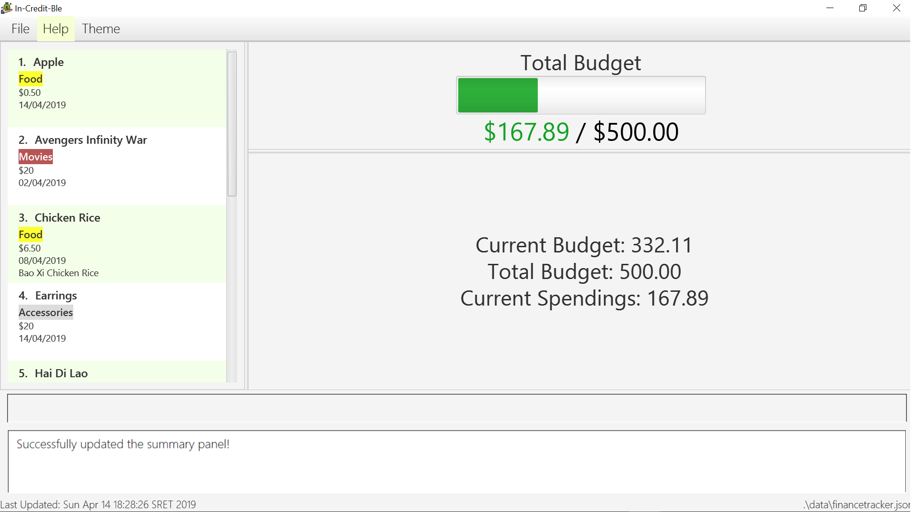

= In-Credit-ble
ifdef::env-github,env-browser[:relfileprefix: docs/]

https://travis-ci.org/CS2103-AY1819S2-W17-3/main[image:https://travis-ci.org/CS2103-AY1819S2-W17-3/main.svg?branch=master[Build Status]]
https://app.netlify.com/sites/increditble/deploys[image:https://api.netlify.com/api/v1/badges/d34bd9d2-f71e-47d5-ae0d-b4a0a68773a4/deploy-status[Netlify Status]]
https://coveralls.io/github/CS2103-AY1819S2-W17-3/main?branch=master[image:https://coveralls.io/repos/github/CS2103-AY1819S2-W17-3/main/badge.png?branch=master[Coverage Status]]
image:https://api.codacy.com/project/badge/Grade/e86318d8b59f445497d610d95dd2e0be["Codacy code quality", link="https://www.codacy.com/app/Jackimaru96/main?utm_source=github.com&utm_medium=referral&utm_content=CS2103-AY1819S2-W17-3/main&utm_campaign=Badge_Grade"]

ifdef::env-github[]
image::docs/images/Ui.png[width="600"]

endif::[]

ifndef::env-github[]
image::images/Ui.png[width="600"]
image::images/Ui_2.png[width="600"]
endif::[]

"Where did all the money in my wallet go!"

Is the above statement something that you asked yourself on a daily basis? Do you have so many micro-transactions that you lose track of all your expenditure? _In-Credit-Ble_ is here to help you out!

_In-Credit-Ble_'s key features:

* Intuitive and easy to use user interface allowing you to add new records fast.
* Easily record the transaction to track where all your transactions.
* Overall view of on your financial transaction via a pie chart which shows a breakdown of your expenditures.

Sold yet? Find out more through the <<UserGuide#, User Guide>>!

_In-CreditBle_ is an open source project that welcomes contribution from the community! If you would like to make any changes, head over to the <<DeveloperGuide#, Developer Guide>> to get started

== Site Map

* <<UserGuide#, User Guide>>
* <<DeveloperGuide#, Developer Guide>>
* <<AboutUs#, About Us>>
* <<ContactUs#, Contact Us>>

== Acknowledgements

* This application was inspired by AddressBook-Level4 project created by SE-EDU initiative at https://github.com/se-edu/.
* Libraries used: https://github.com/TestFX/TestFX[TextFX], https://github.com/FasterXML/jackson[Jackson], https://github.com/google/guava[Guava], https://github.com/junit-team/junit5[JUnit5]
* Application Icon made by https://www.flaticon.com/authors/monkik[monkik] from www.flaticon.com 

== Licence : link:LICENSE[MIT]
