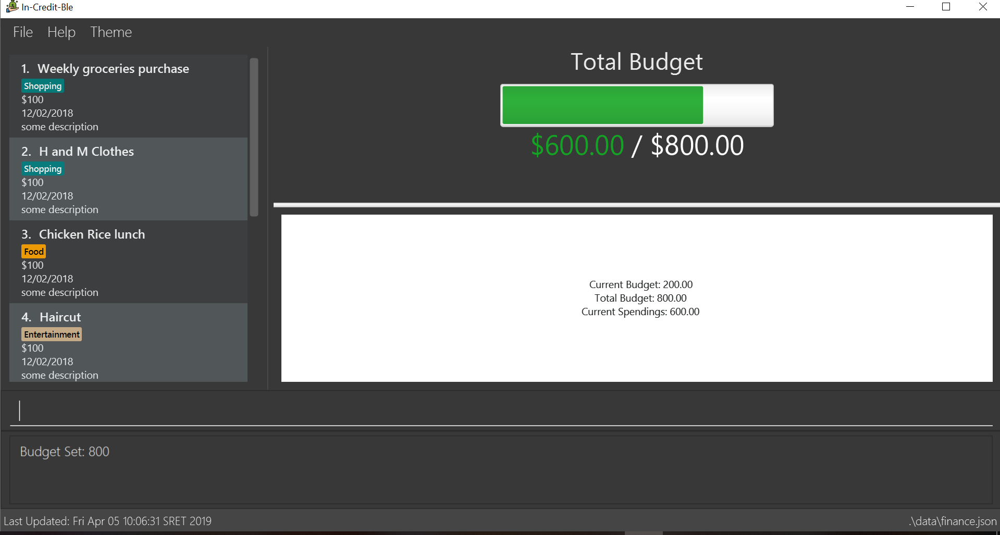

= In-Credit-Ble - User Guide
:site-section: UserGuide
:toc:
:toclevels: 3
:toc-title:
:toc-placement: preamble
:sectnums:
:imagesDir: images
:stylesDir: stylesheets
:xrefstyle: full
:experimental:
ifdef::env-github[]
:tip-caption: :bulb:
:note-caption: :information_source:
endif::[]
:repoURL: https://github.com/cs2103-ay1819s2-w17-3/main

By: `Team W17-3`      Since: `March 2019`      Licence: `MIT`

== Introduction
Welcome to the _In-Credit-Ble_ User Guide! _In-Credit-Ble_ is your all-in-one application in managing and tracking your
personal finances. Our user-friendly interface will make it easy for you to see how much you can safely spend within your budget and be more aware
of your spending habits. If you are a *fast typer*, *prefer to type* over using your mouse and *like to get things done
efficiently*, then this is the product just for you! _In-Credit-Ble_ is designed for those who prefer to work with a
*Command Line Interface (CLI)*.

This user guide shows you how to get started using _In-Credit-Ble_. It also provides in-depth documentation on the
different features and shows you how to perform basic _In-Credit-Ble_ operations.

// tag::quickstart[]
== Quick Start
Follow these steps to get _In-Credit-Ble_ up and running on your computer in no time!

.  Ensure you have Java version `9` or later installed in your computer. You can download and install the required
   Java Development Kit
   link:https://www.oracle.com/technetwork/java/javase/downloads/java-archive-javase9-3934878.html[here]
.  Download the latest `financetracker.jar` file link:{repoURL}/releases[here].
.  Copy the file to the folder you want to use as the home folder for your finance tracker.
.  Double-click the file to start the app. The GUI should appear in a few seconds as shown below.
+

+
.  Type the command in the command box and press kbd:[Enter] to execute it. +
e.g. typing *`help`* and pressing kbd:[Enter] will open the help window.
.  Some example commands you can try:

* *`help`* : opens the _In-Credit-Ble_ user guide
* *`set`* : sets the total budget for Finance Tracker
* *`allocate`* : allocates budget to a certain category (within the total budget)

.  Refer to <<Features>> for details of each command.
// end::quickstart[]

[[Features]]
== Features
This section describes the various features _In-Credit-Ble_ has to offer. Examples are also included to give you
step-by-step instructions on how to use the different commands.

====
*Command Format*

* Words in `UPPER_CASE` are the parameters to be supplied by the user e.g. in `set $/AMOUNT`,
`AMOUNT` is a parameter which can be used as `set $/200.00`.
* Items in square brackets are optional e.g `search KEYWORD [MORE_KEYWORDS]` can be used as `search clothes` or as
`search cake lunch`.
* Items with `…`​ after them can be used multiple times including zero times.
====

=== Budget Management

// tag::set[]
==== Setting a budget: `set`

This command enables you to set a fixed budget for a month/week (Time limit to be implemented). The current budget will be modified based on the transaction records. The command format is as follows:

*Format*: `set $/AMOUNT`

****
*Examples*:

* `set $/500`
* `set $/500.50`
****
// end::set[]

// tag::allocate[]
==== Allocating budget based on categories: `allocate`

You can use this command to set a budget for a category in _In-Credit-Ble_ Finance Tracker. +

*Alias*: `allo`

*Format*: `allocate $/AMOUNT c/CATEGORY`
****
*Examples*:

* `allocate $/50 c/Dining`
* `allocate $/100 c/CloThEs`
* `allocate $/100.10 c/FOOD`
* `allo $/123.10 c/GiRLfrIEND`
****
[NOTE]
====
* If you provide multiple categories (e.g. `allocate $/50.00 c/Food c/Clothes`),
only the last category you provided will be taken (in the previous e.g., the command will
set budget for `Clothes` category.
* Category names are case-insensitive. (e.g. `CLotHes`, `clothes` and `CLOTHES` refer to the same
category and will be shown with the first character in uppercase and the rest of the characters
in lowercase (in the above example, it will be shown as `Clothes`)
* If a budget was previously set for the category, the old category budget will be replaced
by the new `allocate` command
* Category name supplied must be https://en.wikipedia.org/wiki/Alphanumeric[alphanumeric]
and cannot contain special characters such as `:<>;\/|?~^%$#@`
====
// end::allocate[]

// tag::increase[]
==== Increasing the budget: `increase`

You can increase your budget limit for the month/week by the specified amount.

*Format*: `increase $/AMOUNT`

****
*Examples*:

* `increase $/10.10`
* `increase $/100`
****
// end::increase[]

=== Expense Entry Management

// tag::spend[]
==== Adding an expense: `spend`

You can keep track of how much you have spent by adding an expense entry to _In-Credit-Ble_.

*Alias*: `add`

*Format*: `spend n/NAME $/AMOUNT d/DATE c/CATEGORY`

****
*Examples*:

* `spend n/cake $/5.50 d/15/03/2019 c/Food`
* `spend n/movie $/10 d/16/03/2019 c/Entertainment`
****

[NOTE]
====
* If you provide multiple categories (e.g. `spend n/Tshirt $/10.00 d/31/03/2019 c/Food c/Clothes`),
only the last category you provided will be taken (in the previous e.g., the command will
add expense for `Clothes` category.
* Category names are case-insensitive. (e.g. `CLotHes`, `clothes` and `CLOTHES` refer to the same
category and will be shown with the first character in uppercase and the rest of the characters
in lowercase (in the above example, it will be shown as `Clothes`)
* Category name supplied must be https://en.wikipedia.org/wiki/Alphanumeric[alphanumeric]
and cannot contain special characters such as `:<>;\/|?~^%$#@`
====
// end::spend[]

// tag::description[]
==== Adding a description to an entry: `description`

You can add a description to an existing entry in the records to remember details of the amount spent.

*Alias*: `descr`

*Format*: `description INDEX [d/DESCRIPTION]`

****
*Examples*:

* `description 1 d/Father's birthday present` +
Changes the description of entry at index 1 to "Father's birthday present"

* `description 1 d/` +
Removes the description of entry at index 1
****

[NOTE]
====
* `INDEX` here refers to the index number shown in the displayed records.
* `INDEX` *must be a positive integer* 1, 2, 3, ...
====
// end::description[]

// tag::edit[]
==== Editing an entry: `edit`

You can easily edit any part of an existing entry in the records. +
Index refers to the index number shown in the list.

*Alias*: `e`

*Format*: `edit INDEX [n/NAME] [$/AMOUNT] [d/DATE] [c/CATEGORY]`

****
*Examples*:

* `edit 2 $/10.10`
* `edit 1 n/burger c/Food`
****

[NOTE]
====
* `INDEX` here refers to the index number shown in the displayed records.
* `INDEX` *must be a positive integer* 1, 2, 3, ...
* At least one of the optional fields must be provided.
* Existing values will be updated to the input values.
====
// end::edit[]

// tag::select[]
==== Selecting an entry: `select`

You can select an existing entry in the records to view its details by specifying the entry's index number.

*Alias*: `s`, `sel`

*Format*: `select INDEX`

****
*Example*:

* `select 3`
****

[NOTE]
====
* `INDEX` here refers to the index number shown in the displayed records.
* `INDEX` *must be a positive integer* 1, 2, 3, ...
====
// end::select[]

// tag::delete[]
==== Deleting an entry: `delete`

You can delete an entry in the record by specifying the entry's index number.
Deleted entries can be recovered via the `undo` command.

*Alias*: `d`, `del`

*Format*: `delete INDEX`

****
*Example*:

* `delete 2`
****

[NOTE]
====
* `INDEX` here refers to the index number shown in the displayed records.
* `INDEX` *must be a positive integer* 1, 2, 3, ...
====
// end::delete[]

=== Records Management

// tag::list[]
==== Listing all entries: `list`

You can see all the entries you have entered, as long as they are not deleted entries.

*Alias*: `l`, `ls`

*Format*: `list`
// end::list[]

// tag::search[]
==== Locating entry based on name/category: `search`

You can easily search for entries in the records using a name, category or date as keywords. The total sum of money
spent on all the results of the search will also be shown.

*Alias*: `find`

*Format*: `search -FLAG KEYWORD [MORE_KEYWORDS]`

****
*Examples*:

* `search -cat Transport`
* `search -name cake bread`
* `search -date 10/10/2001
****

[NOTE]
====
* `FLAG` here refers to either `-name`, `-cat` or `date`.
* Only one flag should be provided.
====
// end::search[]

// tag::sort[]
==== Sorting the entries according to name/amount/date/category: `sort`

You can choose to sort the list of entries by name, amount, date or category.

*Format*: `sort FLAG`

****
*Examples*:

* `sort -name`: +
Sorts the list of records by name in lexicographical order
* `sort -amount`: +
Sorts the list of records by amount from largest to smallest
* `sort -date`: +
Sorts the list of records by date with the latest at the top
* `sort -cat`: +
Sorts the list of records by category
****

[NOTE]
====
* `FLAG` here refers to either `-name`, `-amount, `-date` or `-cat`.
* Only one flag should be provided.
====
// end::sort[]

// tag::reverse[]
==== Reversing the entries: `reverse`

You can also reverse the order of the list of entries in the records.

*Alias*: `rev`

*Format*: reverse
// end::reverse[]

// tag::summary[]
==== Showing summary of records: `summary`

You can see the summary of your previous expenditures, with an aster plot graph showing how your spending habits are like in the
different categories. It also displays the remaining budget amount for each category.

Deleted entries are not included in the summary.

*Format*: `summary`
// end::summary[]

=== Miscellaneous

// tag::setfile[]
==== Changing FinanceTracker data storage location: `setfile`
Want to maintain multiple users of the FinanceTracker? You can use this command to load FinanceTracker data from another file.
The command will create a file if it does not already exist.

File paths and extension should not be included in command.

*Format*: `setfile f/finance`
//end::setfile[]

// tag::help[]
==== Viewing help: `help`

Forgotten which commands to use? You can easily find the commands you need to navigate the software
by using the following command:

*Format*: `help`
// end::help[]

// tag::undoredo[]
==== Undoing previous command : `undo`

You can restore the program to the state before the previous _undoable_ command was executed.

*Alias*: `u`

*Format*: `undo`

****
*Examples*:
* `delete 1` +
`list` +
`undo` (reverses the `delete 1` command) +

* `select 1` +
`list` +
`undo` +
The `undo` command fails as there are no undoable commands executed previously.

* `delete 1` +
`clear` +
`undo` (reverses the `clear` command) +
`undo` (reverses the `delete 1` command) +
****
[NOTE]
====
_Undoable_ commands:

* commands that modify the finance tracker's content +
(`set`, `spend`, `increase`, `allocate`, `edit`, `delete`, `clear`, `description).
====

==== Redoing the previously undone command : `redo`

You can reverse the most recent `undo` command.

*Alias*: `r`

*Format*: `redo`
****
*Examples*:

* `delete 1` +
`undo` (reverses the `delete 1` command) +
`redo` (reapplies the `delete 1` command) +

* `delete 1` +
`redo` +
The `redo` command fails as there are no `undo` commands executed previously.

* `delete 1` +
`clear` +
`undo` (reverses the `clear` command) +
`undo` (reverses the `delete 1` command) +
`redo` (reapplies the `delete 1` command) +
`redo` (reapplies the `clear` command) +
****
// end::undoredo[]

// tag::theme[]
==== Changing theme of application: `theme`

You can change the theme of the application with pre-set colour themes specified.

*Alias*: `colour`

*Format*: `theme COLOURTHEME`

****
*Examples*:

* `theme DARK`
* `theme BlUE`
* `theme pink`
****

[NOTE]
====
* Valid themes include: `Dark`, `Light`, `Blue`, `Pink`
* The theme name is case-insensitive (`BlUE`, `BLUE`, `blue` or `bLUE` etc. all refer
to `Blue`)
* You can also change the theme of the application by choosing the theme under
the menu bar.

image::themeMenuBar.png[]
====

// end::theme[]
==== Listing entered commands: `history`

You can list all the commands you have entered in reverse chronological order.

*Alias*: `h`, `hist`

*Format*: `history`

==== Clearing all entries : `clear`

You can delete all existing entries in the records and reset your budget to $0.00.

*Alias*: `c`, `clr`

*Format*: `clear`

==== Exiting the program : `exit`

You can quit the program at any point in time when you use this command.

*Alias*: `quit`

*Format*: `exit`

==== Saving the data

The finance record and allocated budget will be saved in the hard disk automatically after any command that changes
the data. There is no need for you to save manually.

=== Upcoming features

// tag::savingpatterns[]
==== Establish saving patterns based on record and derive projected savings/expenses in a time span `[coming in v2.0]`

Your monthly finance records will be archived at the end of the month. This information will be used to derive
the projected savings and expenses based on your typical spending patterns.
// end::savingpatterns[]

==== Links to financial articles `[coming in v2.0]`

You will be able to list categories of financial articles that you are interested in
(e.g. investment, stock market). Based on these categories, _In-Credit-Ble_ will use Google API to search for
related articles for you to view.

==== Separate expenditures based on methods of payment (Cash, Visa, Paylah) `[coming in v2.0]`

_In-Credit-Ble_ will link up with secure methods of payment such as payLah, Visa/MasterCard, Amex or Paypal to allow
tracking of your cashless transactions. By paying through _In-Credit-Ble, transactions will automatically be updated
and recorded as entries.

== FAQ

*Q*: How do I transfer my data to another Computer?

*A*: You can install the app in the other computer and overwrite the empty data file it creates with the file
that contains the data of your previous _In-Credit-Ble_ folder.

*Q*: Will the application support different currency?

*A*: At the current version, the application is unable to support transactions record in different currency.
You will need to calculate and enter your input based on your local currency.

_In-Credit-Ble_  aims to support multi-currency transactions in `v2.0`.

== Command Summary

=== Budget Management
[width="59%",cols="22%,<23%,<25%,<30%",options="header",]
|=======================================================================
| Command | Command Format | Alias | Example
| Set Budget | `set $/AMOUNT` |- | `set $/500`
| Allocate budgeting based on categories | `allocate $/AMOUNT c/CATEGORY` | `allo` | `allocate $/100 c/Shopping`
| Increase budget | `increase $/AMOUNT` | - | `increase $/10.10`

|=======================================================================

=== Expense Entry Management
[width="59%",cols="22%,<23%,<25%,<30%",options="header",]
|=======================================================================
| Command | Command Format | Alias | Example
| Add expense | `spend n/NAME $/AMOUNT d/DATE [c/CATEGORY] ...` | `add` | `spend n/movie $/10 d/16/03/2019 c/Entertainment`
| Add a description to an entry | `description INDEX d/DESCRIPTION` | `descr` | `description 1 d/Father's birthday present`
| Edit an entry | `edit INDEX [n/NAME] [$/AMOUNT] [d/DATE] [c/CATEGORY]` | `e` | `edit 1 n/burger c/Food`
| Select an entry | `select INDEX` | `s`, `sel` | `select 3`
| Delete an entry | `delete INDEX` | `d`, `del` | `delete 2`

|=======================================================================

=== Records Management
[width="59%",cols="22%,<23%,<25%,<30%",options="header",]
|=======================================================================
| Command | Command Format | Alias | Example
| List all entries | `list` | `l`, `ls` | -
| Locate entry based on name, category or date |`search -FLAG KEYWORD [MORE_KEYWORDS]` | `find` | `search -cat Food`
| Sort the entries | `sort FLAG` | - | `sort -name`
| Reverse all entries | `reverse` | `rev` | -
| Show summary of records | `summary` | - | -

|=======================================================================

=== Miscellaneous
[width="59%",cols="22%,<23%,<25%,<30%",options="header",]
|=======================================================================
| Command | Command Format | Alias | Example
| Set data file | `setfile` | - | `setfile f/finance`
| Help | `help` | - | -
| Undo previous command | `undo` | `u` | -
| Redo previously undone command | `redo` | `r` | -
| Change colour theme of application | `theme` | `colour` | theme light
| List entered commands | `history` | `h`, `hist` | -
| Clear all entries | `clear` | `c`, `clr` | -
| Exit the program | `exit` | `quit` | -

|=======================================================================

== Glossary

Amount::
The amount of money for expenditure and budget

Category::
The category that an entry belongs to.

Entry::
A listed item/activity tracked by the application.  It generally consists of the name, amount and date along with a
compulsory category tag

Records::
The list of all entries stored in the application
